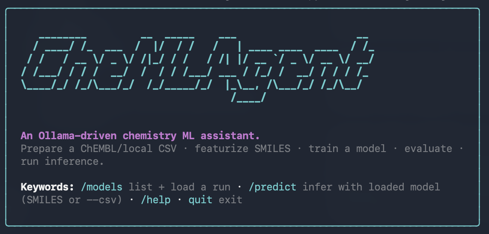

# CheMLAgent



An agentic system for building and training ML models for chemistry (QSAR /
bioactivity / property prediction), driven by **Ollama tool calls**.

A chat model is handed a small set of plain Python functions — discover a
target, prepare a CSV, featurize SMILES, train a model, evaluate it, run
inference — and decides which to call to satisfy a modeling request. Ollama
infers each tool's JSON schema from the function signature + docstring, so the
"agent" is just a thin dispatch loop over real, reusable chemistry code.

## Pipeline

```
[discovery, optional]
  search_targets   (disease → gene symbols)
  search_uniprot   (protein name → UniProt IDs)
  list_bioactives  (UniProt → ChEMBL target ID + counts)
        │
        ▼
prepare_chembl_csv  ──►  featurize_fingerprints  ──►  train_model   ──►  evaluate_model
  (CSV / ChEMBL ID)        (fingerprints /           (RF / LightGBM /      (held-out test)
  ← or input_csv directly   descriptors)              SVR)
                                                   ──►  train_mlp          ──►  run_inference(_mlp/_chemprop)
                                                   ──►  train_chemprop
                                                        (MPNN on mol graphs)
```

The discovery tools are optional — use them when the request gives a protein
name or disease rather than a ChEMBL ID. Once you have a `chembl_id`,
`prepare_chembl_csv` fetches and normalizes the dataset (give it a local
`input_csv` instead to skip discovery and fetch entirely).

State between tool calls lives on disk under `runs/<run_id>/` (fitted models,
featurizers, feature matrices, a `manifest.json`), referenced by path in the
JSON returned to the model — Ollama tool calls exchange JSON, not live objects.
Thread the same `run_id` through every stage of one task.

As each stage completes, its user-facing products (the prepared `data.csv`,
trained model, inference `predictions.csv`, and `manifest.json`) are copied into
`recent_work/<run_id>/` so they're easy to find mid-session. On quit the CLI
**moves** the final products into `recent_work/<run_id>/`, deletes the
intermediate scratch left in `runs/<run_id>/` (feature matrices, lightning
checkpoints, the run dir itself), and prints the absolute paths of the
**runs produced this session only** — runs already in `recent_work/` from
previous sessions are not listed. The CheMeleon foundation cache at
`runs/chemeleon_mp.pt` is kept.

## What it can do

- **Discover a target** — when you only have a protein name or a disease (not a
  ChEMBL ID), `search_targets` lists proteins associated with a disease (Open
  Targets), `search_uniprot` resolves a protein/gene name to UniProt accessions
  (optionally human-only), and `list_bioactives` maps UniProt IDs to ChEMBL
  target IDs with their activity counts so you can pick the richest target.
- **Prepare data** — read a local CSV, or fetch from ChEMBL by target ID
  (either given directly or found via the discovery tools).
  SMILES/target columns are autodetected (handles `SMILES`, `smiles`,
  `canonical_smi`, etc., and `IC50`/`pIC50`/`EC50`/`Ki`/`Kd`/`Lmax`/`λ_max`/
  `potency`/…). A log10 transform is autodetected when the target range is
  ≥ 1000 (e.g. nM IC50); inference inverts it automatically.
- **Featurize** — fingerprints & descriptors via scikit-fingerprints: ECFP
  (Morgan), Atom-Pair, Mordred, RDKit 2D, MACCS, PubChem, EState, functional
  groups, RDKit path, plus 3D types (E3FP, Autocorr, MORSE, RDF) with
  conformer generation. Murcko-scaffold train/test split.
- **Train** — Random Forest, LightGBM, SVR (literature-tuned poly kernel), a
  PyTorch wide-and-deep MLP, and a Chemprop message-passing neural network
  (with optional CheMeleon foundation fine-tuning).
- **Evaluate & infer** — metrics on the held-out split; predictions for new
  SMILES in original units.

## Requirements

- **Python 3.14** (pinned in `pyproject.toml`). The cp312 torch wheel segfaults
  inside chemprop/lightning training; the cp314 wheel trains on Apple MPS
  without issue, so the project requires 3.14.
- [uv](https://docs.astral.sh/uv/) for environment management.
- An Ollama endpoint (cloud or local) with a chat model that supports tool
  calls, e.g. `glm-5.2`, `gemma3:27b`, `qwen2.5`.

## Install

```bash
uv venv --python 3.14
uv sync --all-extras      # base + mlp + chemprop + chembl
# or pick extras:  uv sync --extra mlp --extra chemprop --extra chembl
```

Extras:

| extra       | brings in                              |
|-------------|----------------------------------------|
| `mlp`       | torch, matplotlib (PyTorch MLP)        |
| `chemprop`  | chemprop, lightning, torch (MPNN)      |
| `chembl`    | chembl_webresource_client (ChEMBL fetch)|
| `all`       | all of the above                       |
| `dev`       | pytest                                 |

Configure the Ollama client via environment variables:

```bash
export OLLAMA_HOST=https://ollama.com   # or http://localhost:11434 for local
export OLLAMA_API_KEY=...               # only if your host requires it
```

## Usage

Interactive REPL:

```bash
uv run python -m chemlagent.agent --print --model glm-5.2
```

`--print` shows the model's thinking, tool calls, and results; `--model` selects
the chat model (defaults to the first of `DEFAULT_MODELS` in `agent.py`).

### REPL keywords

The REPL also takes deterministic keywords that skip the chat model and act
directly on saved runs (the banner lists these at startup):

| keyword                                       | action                                            |
|-----------------------------------------------|---------------------------------------------------|
| `quit` / `exit`                               | exit; move products to `recent_work/`, print paths |
| `/models`                                     | list saved runs, then pick one (row number or `run_id`) to load |
| `/predict <SMILES ...>`                       | inference for inline SMILES with the loaded model |
| `/predict --csv <f> [--smiles-col C] [--out o.csv]` | batch: load SMILES from a CSV, predict with the loaded model |
| `/predict <run_id> <SMILES ...>`              | load that run, then predict (becomes the loaded model) |
| `/help`                                       | show the keywords                                 |

The flow is **load-then-predict**: `/models` lists the saved runs in
`recent_work/` and loads the one you pick; it stays loaded (the prompt shows
`[run_id]` when one is active) so later `/predict` calls reuse it with inline
SMILES or `--csv` — no `run_id` needed. `/predict <run_id> …` loads a run and
predicts in one step. These reuse the deterministic reload code
(`chemlagent.reload`), so no Ollama call is involved. Anything that isn't a
keyword is sent to the model as your request.

### Example prompt

> Build a QSAR model for the human MAO-B protein. I don't have a ChEMBL ID —
> discover one: search UniProt for `MAOB` (human only), then list the bioactives
> to find the ChEMBL target with the most IC50s. Prepare a 600-row dataset
> (`run_id=maob`), featurize with ECFP, and train a random forest. Report the
> ChEMBL ID and test R².

This drives the full discovery → prepare → featurize → train chain. On a live
run it resolves MAO-B → UniProt P27338 → CHEMBL2039 (5,751 IC50s), trains on 600
rows, and reports R² ≈ 0.18 on the held-out scaffold split (overfits at 600
rows; `limit=0` for all 5,751 generalizes better).

Or, with a local CSV (no discovery / fetch):

> Use the local CSV `621-azo.csv` (SMILES column `SMILES`, target column `Lmax`).
> Prepare it with `run_id=azo`, train a chemprop model (`foundation=True`,
> `epochs=15`), then predict λ_max for `c1ccc(/N=N/c2ccccc2)cc1` and
> `C[N]1N=NC(=N1)N=NC2=CC=CC=C2`. Report test R², MAE, and the predictions in nm.

On the azo dataset this yields ~R² 0.90, ~MAE 15 nm, and predicts azobenzene at
~320 nm (matching its experimental π→π\* band).

## Tools

Each is a plain function in `src/chemlagent/tools.py` with a numpydoc docstring
that doubles as the Ollama tool schema.

| tool                     | args (besides `run_id`)                                   |
|--------------------------|-----------------------------------------------------------|
| `search_targets`         | `disease_names`                                           |
| `search_uniprot`         | `protein_names`; `human_only` (default `False`)           |
| `list_bioactives`        | `uniprot_ids`; `activity_type` (default `IC50`)           |
| `prepare_chembl_csv`     | `chembl_id` *or* `input_csv`; `limit`, `units`, `activity_type` |
| `featurize_fingerprints` | `fp_type` (default `ECFP`), `test_size`                   |
| `train_model`            | `model_type` (`random_forest`/`lightgbm`/`svr`), `n_estimators` |
| `evaluate_model`         | —                                                         |
| `run_inference`          | `smiles_list`                                             |
| `train_mlp`              | `epochs` (default 2500, the tuned value)                  |
| `run_inference_mlp`      | `smiles_list`                                             |
| `train_chemprop`         | `epochs` (default 30), `foundation` (default `True`)      |
| `run_inference_chemprop` | `smiles_list`                                             |

Arguments are deliberately minimal to keep tool calls well-formed. Hyperparameters
that aren't exposed use tuned internal defaults (e.g. the SVR poly kernel, the
MLP's SGD/lr/weight-decay/batch config, chemprop's Noam-style LR schedule).

### CheMeleon foundation model

`train_chemprop(foundation=True)` initializes the message-passing block from the
[CheMeleon](https://arxiv.org/abs/2506.15792) pretrained weights (downloaded
once to `runs/chemeleon_mp.pt`) and fine-tunes a fresh regression head —
transfer learning that converges in a few epochs. Set `foundation=False` to
train a from-scratch MPNN.

## Where input CSVs come from

`prepare_chembl_csv` takes a path in its `input_csv` argument and reads it
**as given, relative to your current working directory** (it does not search
anywhere). When you launch the agent from the project root —
`uv run python -m chemlagent.agent` — that CWD *is* the repo root, so a CSV
dropped there (e.g. the bundled `621-azo.csv`, `CHEMBL220_bioactives.csv`) is
reachable by bare filename: `input_csv="621-azo.csv"`. Absolute paths work too,
for CSVs living elsewhere. If `input_csv` is omitted, pass a `chembl_id` to
fetch from ChEMBL instead.

## What an inference call needs

Inference needs **only a `run_id` plus a list of SMILES strings — no CSV**.
The model + featurizer (and, for the MLP, the preprocessing stats) are reloaded
from the saved run artifacts, the new SMILES are featurized, and predictions
come back in original units with any log transform inverted. The SMILES are
whatever you type in the prompt (e.g. *"predict for c1ccc(/N=N/c2ccccc2)cc1
and CC(=O)Oc1ccccc1C(=O)O"*); there is no agent tool that reads a CSV of
SMILES for batch inference. For batch prediction from a CSV, use the
deterministic reload CLI below (`predict --csv`).

## Reloading saved models (deterministic, no Ollama)

`src/chemlagent/reload.py` lets you reuse a run's products straight from
`recent_work/<run_id>/` without going through the agent. It dispatches on the
manifest's `model_type` (random_forest / lightgbm / svr / mlp / chemprop) and
applies the manifest's log-transform inversion, so predictions are in original
units.

```bash
# list every saved run with its metrics
uv run python -m chemlagent.reload list

# predict for SMILES given on the command line
uv run python -m chemlagent.reload predict azo "c1ccc(/N=N/c2ccccc2)cc1"

# batch: read SMILES from a CSV, write predictions to a CSV
uv run python -m chemlagent.reload predict azo \
    --csv 621-azo.csv --smiles-col SMILES --out preds.csv
```

Paths resolve from `recent_work/<run_id>/` by the known filenames for each
model type, so it works whether or not the manifest's path fields were
rewritten at quit.

## Project layout

```
src/chemlagent/
  agent.py              Ollama dispatch loop + CLI
  tools.py              the 12 Ollama-callable tool functions (3 discovery + 9 pipeline)
  data.py               CSV prep (local + ChEMBL), column/log autodetect
  fingerprints.py       scikit-fingerprints wrappers + scaffold split
  models.py             RF / LightGBM / SVR + evaluate
  pytorch_mlp.py        wide-and-deep PyTorch MLP
  chemprop_model.py     Chemprop MPNN data + model classes
  descriptor_cleaning.py  impute / aggressive feature cleaners
  products.py            publish products to recent_work/ + list them on quit
  reload.py              deterministic model reload + inference from recent_work/
tests/test_smoke.py     end-to-end MVP round-trip on synthetic data
runs/<run_id>/          working run artifacts (gitignored, regenerable)
recent_work/<run_id>/   curated products copied out as stages complete (gitignored)
```

## Tests

```bash
uv run pytest
```

`test_smoke.py` exercises `prepare → featurize → train (RF) → evaluate` on
synthetic data, so the tools are verifiable without hitting Ollama.

## Notes

- **torch before lightgbm import order.** `tools.py` imports `torch` (guarded)
  before `chemlagent.fingerprints`/`chemlagent.models`. On Apple Silicon both
  torch and lightgbm bundle OpenMP; if lightgbm's loads first, torch ops
  segfault. Don't reorder those imports.
- No grid search is exposed (per scope); pass explicit hyperparameters or rely
  on the tuned defaults.
- `CLAUDE.md` holds the original project brief / agent instructions.